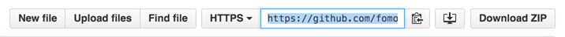

# Distracted Drivers Starter Project

This starter project currently ranks in the top 15% of submissions and with a few minor changes can reach the top 10%.

Follow the Fomoro cloud setup instructions to get started with AWS spot instances without the hassle of setting up infrastructure. Fomoro provisions GPU instances, tracks model and dataset versions, and allows you to focus on iteration.

## Training

Before using this code you must agree to the [Kaggle competition's terms of use](https://www.kaggle.com/c/state-farm-distracted-driver-detection).

### Setup

Feel free to [email me](mailto:jim@fomoro.com) or [reach out on Twitter](https://twitter.com/jimmfleming) if you need help getting started.

1. Follow the [installation guide](https://fomoro.gitbooks.io/guide/content/installation.html) for [Fomoro](https://fomoro.com).
2. [Fork this repo](https://help.github.com/articles/fork-a-repo/).
2. [Clone the forked repo](https://help.github.com/articles/cloning-a-repository/).

### Dataset Preparation

In this step we'll upload the dataset to Fomoro for training.

1. Download the images and drivers list into the "dataset" folder:
2. Unzip both into the "dataset" folder so it looks like this:

  - distracted-drivers-tf/
    - dataset/
      - imgs/
        - train/
        - test/
      - driver_imgs_list.csv

3. From inside the dataset folder, run `python prep_dataset.py`. This generates a pickled dataset of numpy arrays.
4. Again, from inside the dataset folder, run `fomoro data publish`. This will upload the dataset to Fomoro for training.

### Model Training

1. Copy the clone url from your fork on Github:

2. Insert the clone url into the "repo" line of the `fomoro.toml` config in the root of the repo.
3. Insert your Fomoro username as described in the `fomoro.toml` config.
4. Add the model to Fomoro: `fomoro model add`.
5. Start a training session: `fomoro session start -f`. Training should take a little over 30 minutes.

### Making Changes

When you want to train new code, simply commit the changes, push them to Github, then run `fomoro session start -f`.

You can type `fomoro help` for more commands.

### Running Locally

This project uses [TensorFlow](https://www.tensorflow.org/versions/r0.7/get_started/os_setup.html#download-and-setup). To run the code locally simply install the dependencies and run `python main.py`.

## Model Development

1. Tune your learning rate. If the loss diverges, the learning rate is probably too high. If it never learns, it might be too low.
2. Good initialization is important. The initial values of weights can have a significant impact on learning. In general, you want the weights initialized based on the input and/or output dimensions to the layer (see Glorot or He initialization).
3. Early stopping can help prevent overfitting but good regularization is also beneficial. L1 and L2 can be hard to tune but batch normalization and dropout are usually much easier to work with.
